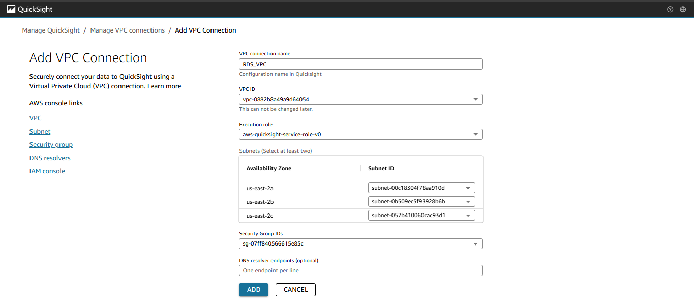

# AWS RDS (MySQL) + Amazon QuickSight — Secure Visualization

## Project Overview
This project demonstrates how to create and **securely** connect a MySQL database on **Amazon RDS** to **Amazon QuickSight** for visualization.  
It follows AWS security best practices using **VPC connections** and **security groups**.

- **Cloud**: AWS  
- **Services**: RDS (MySQL), QuickSight, IAM, Security Groups  
- **Focus**: Secure private connectivity (no public DB), least-privilege access  

---

## Steps I Followed

### 1. Create RDS Instance
I created a MySQL database on Amazon RDS using **Easy Create** with the Free Tier option, naming it `QuickSightDatabase`.

---

### 2. Public Access Setup (Initial)
At first, I allowed public inbound rules so MySQL Workbench could connect.  
This was later replaced with a **more secure private configuration**.

---

### 3. Populate Database via MySQL Workbench
I connected to the RDS instance using **MySQL Workbench**, created the `newhire` table, and inserted employee data.

---

### 4. Connect QuickSight (Public Network)
I initially connected QuickSight to RDS using **public access**, validated the connection, and tested dataset creation.
However, this solution was risky because the RDS instance was publicly accessible.

---

### 5. Create QuickSight VPC Connection
To secure communication, I configured a **VPC connection** in QuickSight and attached it to a dedicated security group.  
This ensures private access inside the same VPC, instead of exposing the DB publicly.

---

### 6. Secure RDS with a Dedicated Security Group
I made the RDS instance **private**, created `RDS_SecGp`, and allowed inbound **MySQL (port 3306)** only from `QuickSight_SecGp`.

---

### 7. Reconnect RDS to QuickSight and Visualize
Finally, I reconnected QuickSight to the secured RDS instance via the VPC connection.  
I built a chart showing the sum of salaries by job role.

---

## Key Security Takeaway
At first, making the RDS instance **publicly accessible** was a major security risk.  
I solved this by restricting access so that **only QuickSight can connect** to RDS through private security groups and a VPC connection.

---

## Learnings
- How Amazon RDS simplifies relational database setup and management.  
- The importance of avoiding **public database exposure**.  
- Configuring IAM roles, VPC connections, and Security Groups for secure service-to-service communication.  

---

## Time Spent
~2 hours (setup, configuration, and visualization).

---

## Files
- Report: [`docs/aws-rds-report.pdf`](docs/aws-rds-quicksight-project.pdf)

---

## Credits
This project was completed as part of a guided exercise from [Nextwork.org](https://learn.nextwork.org/projects/aws-databases-rds).  
Additional steps were included to improve **AWS security best practices**.
